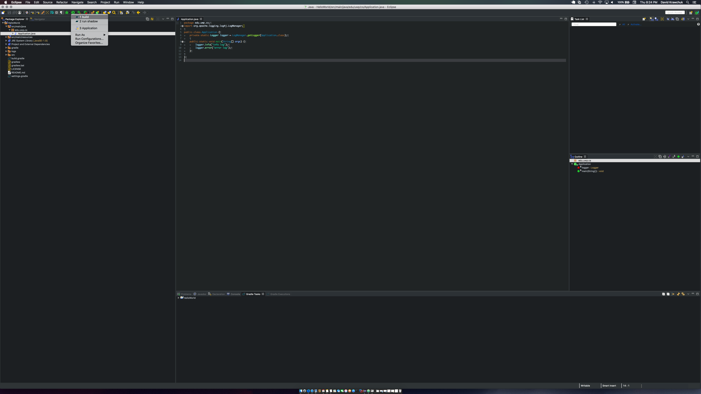

# Build Java Artifact

## Step 1

### Run ```build``` configuration

From the play button select the ```build``` configuration.



## Step 2

After the configuration has run open ```file explorer``` or ```finder``` and locate the jar.

The path location relative to the base of the project will be as follows ```HelloWorld-Template/build/libs/HelloWorld-all.jar```
