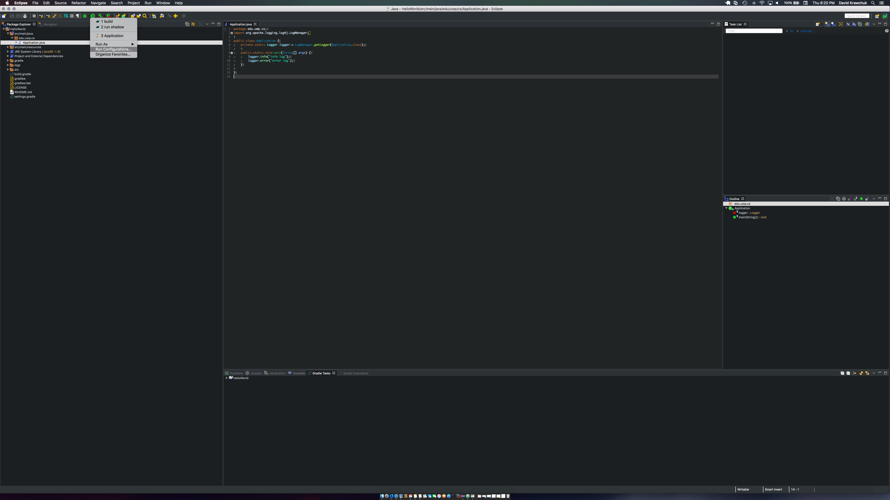
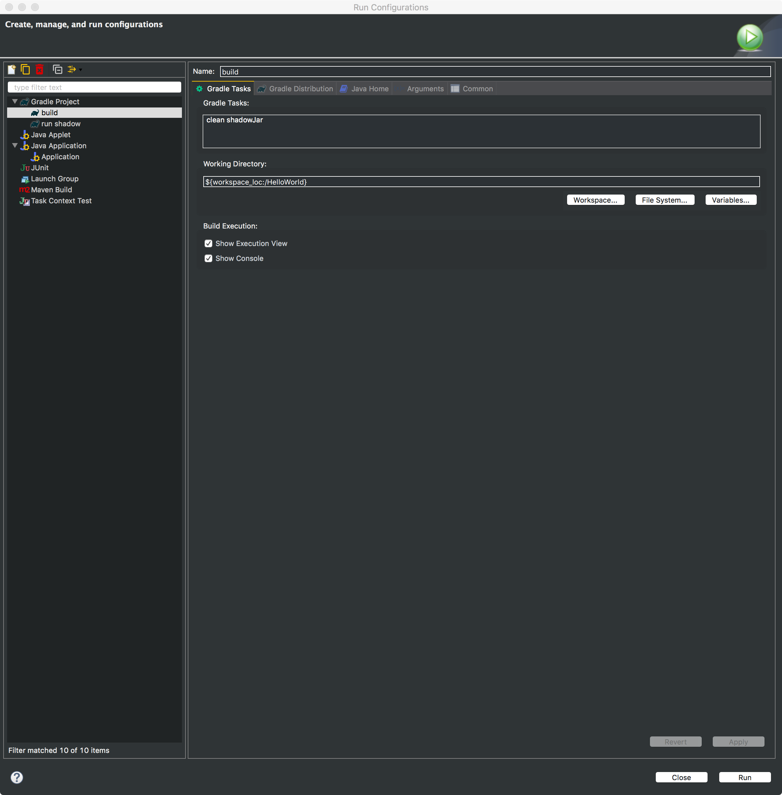
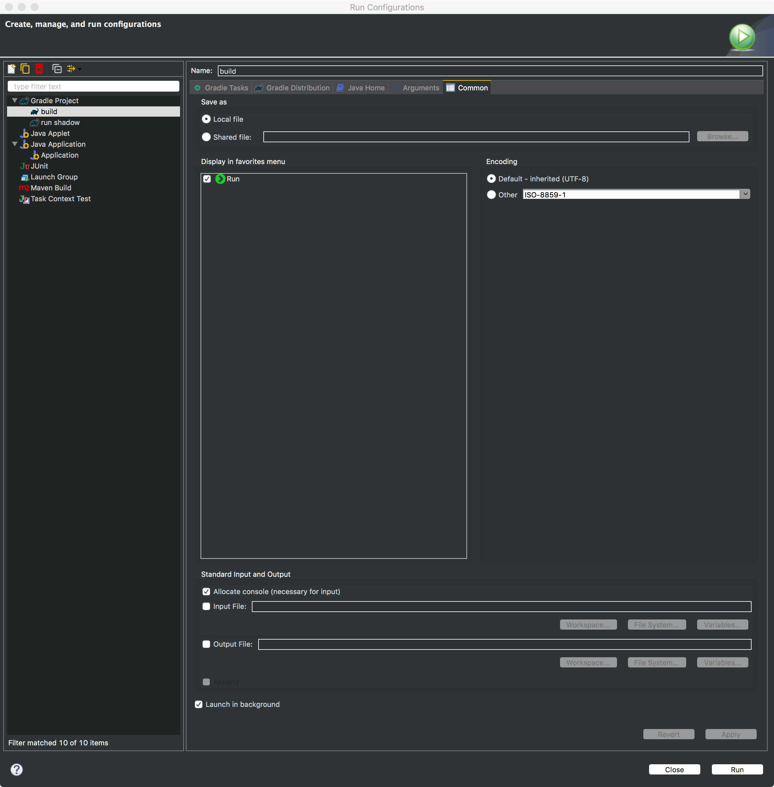
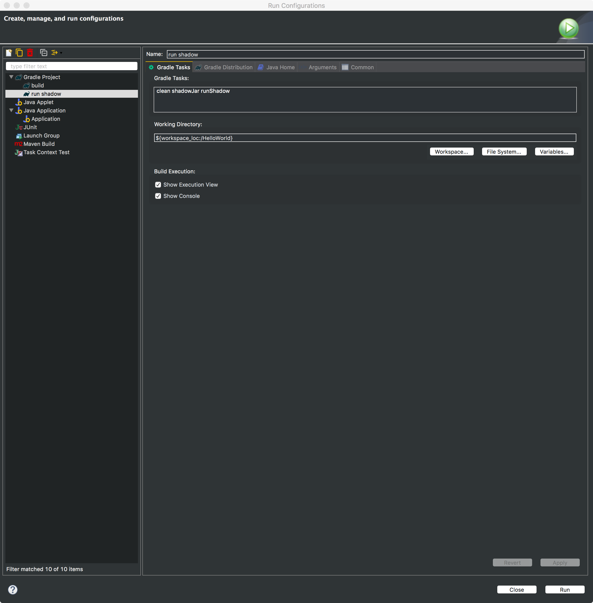
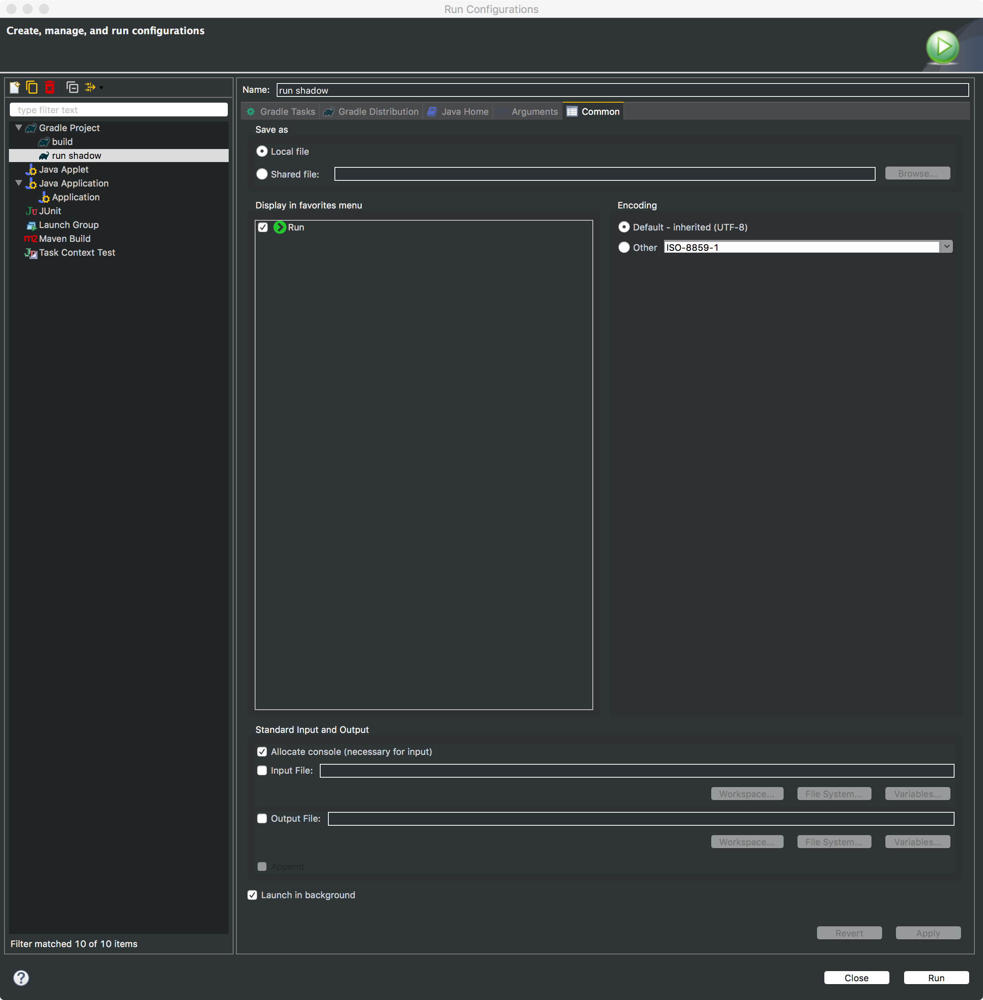

# Gradle Run Configurations Setup

## Step 1

Select the disclosure arrow from the play button located towards the top of your screen.

## Step 2

Select the ```Run Configurations...``` option from the list of options.



## Step 3

Create a build configuration as shown in the images below. Your configuration should be filled out the same way.






## Step 4

Create a run configuration as shown in the images below. Your configuration should be filled out the same way.

This configuration utilizes both the ```gradle application plugin``` as well as ```gradle shadow jar plugin```.





