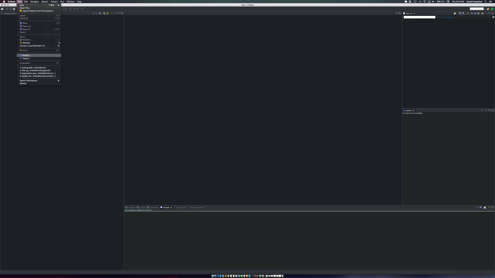
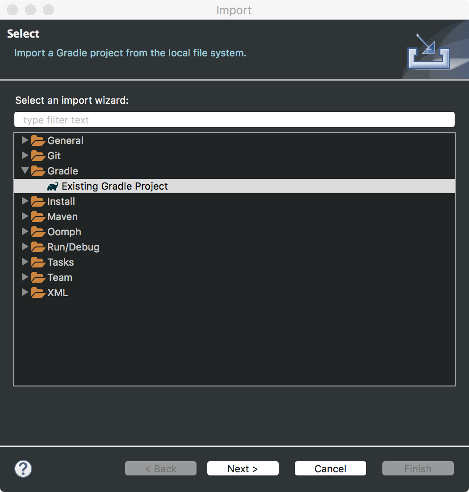
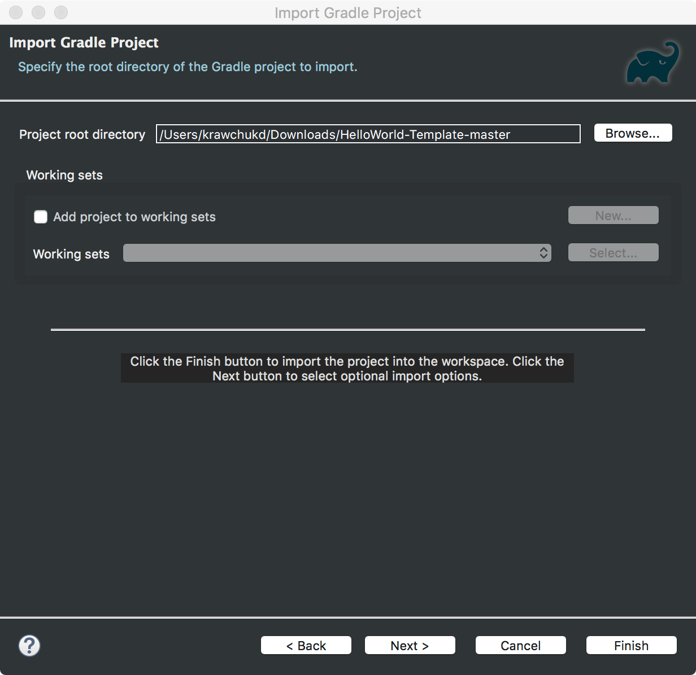
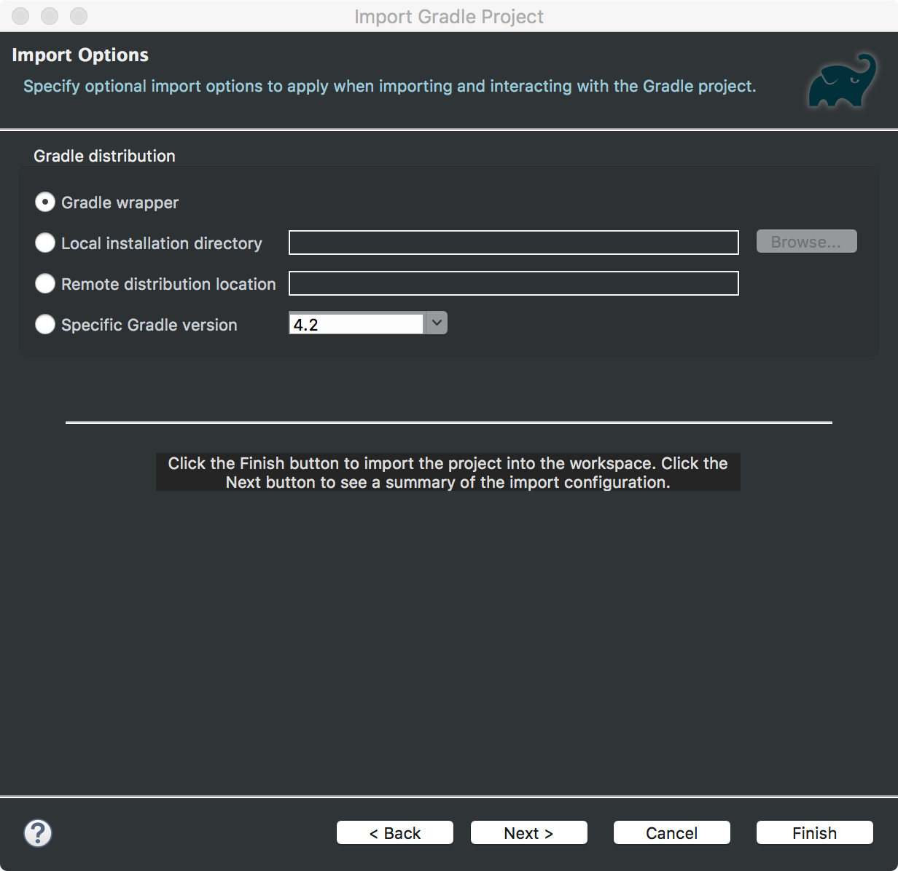
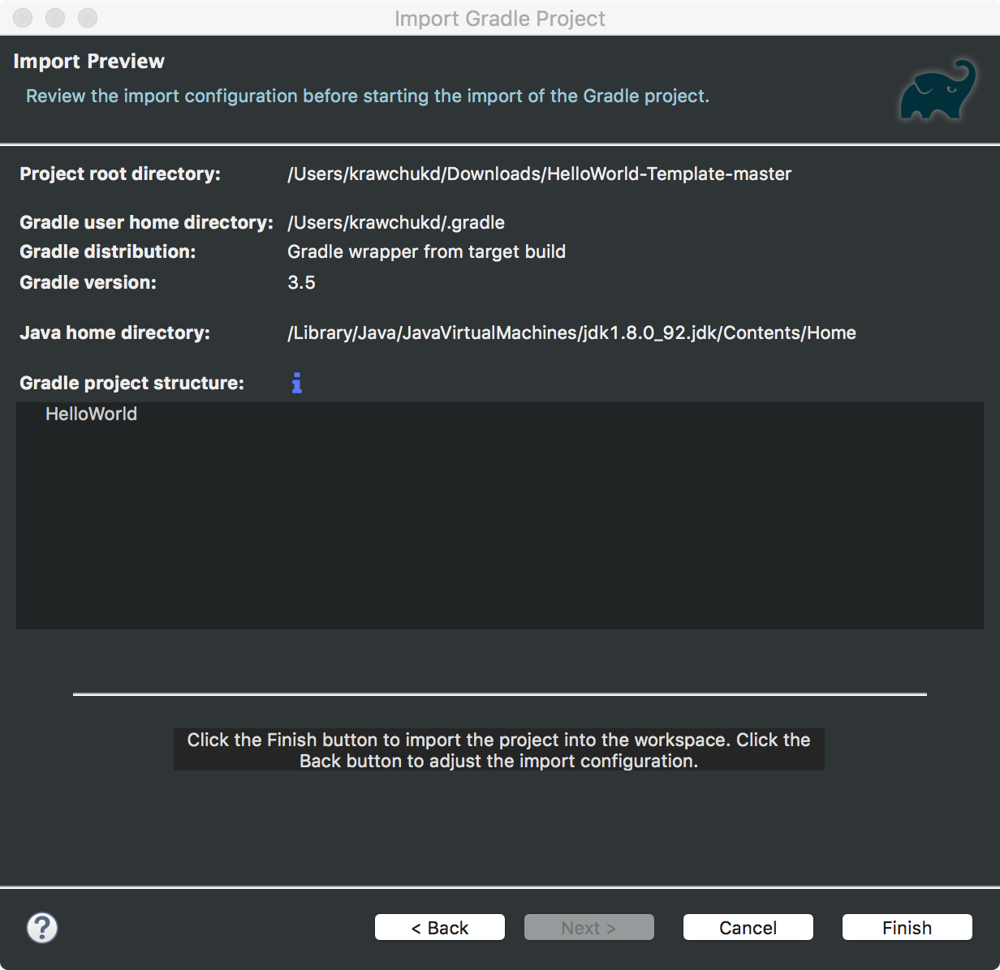
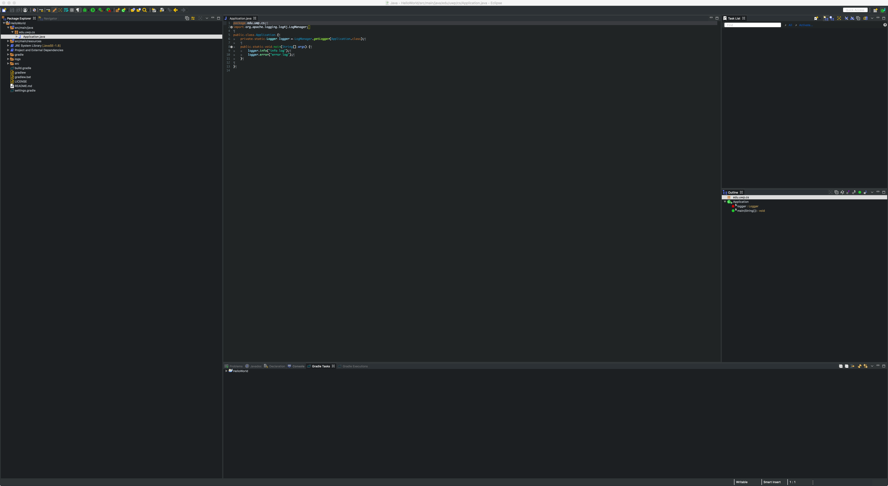

# Import Gradle

## Initial Steps

Obtain a copy of the repository, either as a zip or through a source control client.

# Project Import

## Open Eclipse

## In the file menu select ```import``` from the dropdown list.


## Select gradle project from the import list.


## Browse to project path


## Verify Gradle Wrapper is selected.


## Project Layout View. Select Finish.


## Application Layout

The image below shows the basic layout of the application using Eclipse's **Project Explorer View**. **Application.java** stored
in the following path ```src/main/java/edu/uwp/cs/Application.java``` contains the ```main``` routine used to run the java program.


