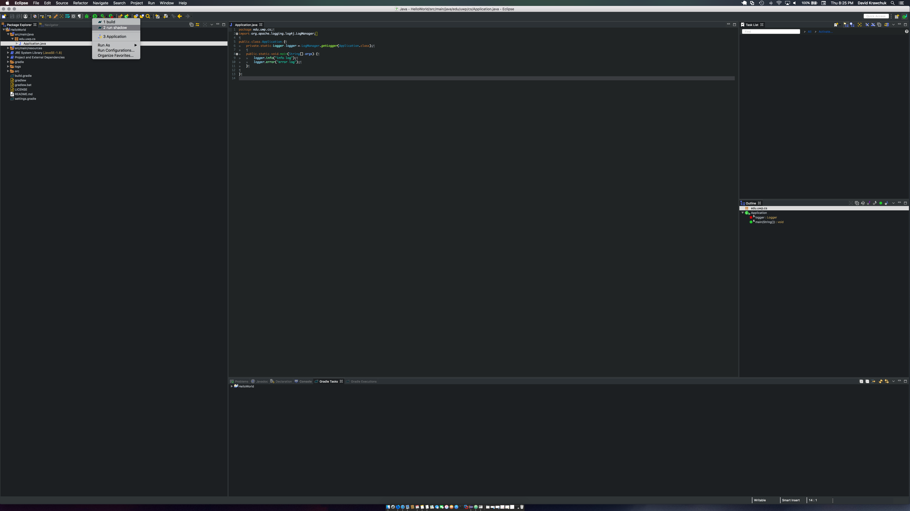
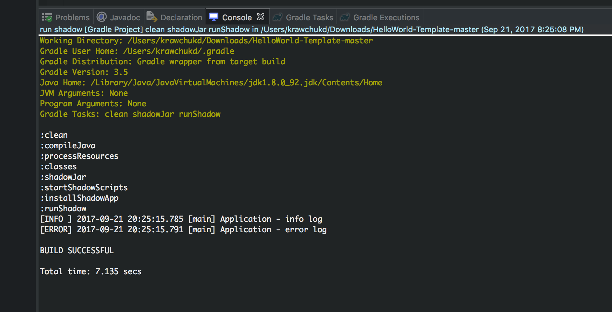
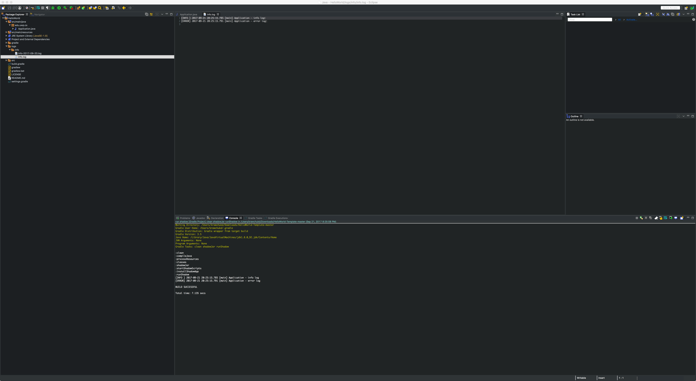

# Running Artifact

To just run the program JAR follow the steps outlined below.

## Step 1

Select the run shadowJar configuration.



## Step 2

Open the console view located on a set of tabs at the bottom third of the Eclipse window.

You should see output similar to the following as shown below.



## Step 3

By default all logging messages go to both the console as shown in step two and a file appender located at ```HelloWorld-Template/logs/info```.


